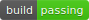
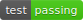
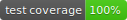
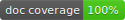
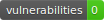

# The Luxury Python Template





[](https://github.com/psf/black)

There are great tools available to automatically style, analyze and build your code. 
They help you deliver better products faster. However, you have to learn how they work, 
configure them and clean up after them. It’s easy to forgo this tedious work in the 
beginning when all you can think about is the bright idea behind your new python 
package. Will you do that later on? Probably not, because then chances are high that you 
get hundreds of complaints from these tools and fixing them all will likely set you back 
for weeks. Its way more fun to focus on new features anyway.  <br />

Writing better code would be so much easier if any new project, regardless of whether it 
starts out as an afternoon experiment or the next big thing, would already include all 
of the bells and whistles that professional packages use. For free and without having to 
register yourself for yet another online service.  <br />

With the luxury python template, you can have all that right from the start! It is very 
opinionated, meaning the only thing you have to think about is the project name. It 
comes with a single, zero configuration command-line tool. Its options are intentionally 
limited and therefore easy to remember. You get everything with a single call of:

```Shell
python package.py build
```

This includes:
- Installing all needed dependencies.
- Sorting import statements alphabetically with [isort](https://pycqa.github.io/isort/).
- Styling your code [Black](https://github.com/psf/black).
- Static type analysis with [MyPy](https://github.com/python/mypy).
- Checking for residual style errors with [Flake8](https://github.com/PyCQA/flake8).
- Checking for security issues with [Bandit](https://github.com/PyCQA/bandit).
- Checking for known vulnerabilities in dependencies with [Safety](https://github.com/pyupio/safety).
- Running tests with [Unittest](https://docs.python.org/3/library/unittest.html) and 
evaluating test coverage with [Coverage.py](https://github.com/nedbat/coveragepy)
- Generating documentation with [Sphinx](https://www.sphinx-doc.org/en/master/) and 
markdown support from [MySt](https://myst-parser.readthedocs.io/en/latest/).
- Checking for undocumented code (built into `package.py`).
- Generating a single, beautiful report for all of the above with [Pico.css](https://picocss.com/).
- Building wheel files and incrementing the version number according to 
[calendar versioning](https://calver.org/).
- Generating badges with the most important metrics for your repository like the ones 
shown above.
- Removing temporary files and folders.

## Example Report
The `package.py` tool that comes with the template can generate a single, 
beautiful report that summarizes the results of the above-mentioned tools. Want an example?
Have a look at the following, problematic code:

```python
import hashlib
import subprocess

from flask import Flask

def getHash(password: str):
    """
    This is an example function for encrypting passwords.

    Args:
        pw: The password to be encrypted.
    """
    return hashlib.md5(password.encode("utf-8"))
```

In this example, the code is stored in `src/bad_example.py`. If you run 
`python package.py build` you will get the report. 
[Have a look!](https://woernerm.github.io/luxury_python_template/)

## Quick Guide
1. The template follows the instructions of the 
[PyPa packaging tutorial](https://packaging.python.org/tutorials/packaging-projects/). 
So, it should look familiar to most people. Using the template is easy. Just click the 
green "Use this template" button above (you need to be signed into GitHub) to create 
your own repository with all the files automatically copied from this template. 
Alternatively, you may just download / clone a copy of the files.
2. Provide some information about your project in setup.cfg. You can find details about 
the fields in the
[PyPa packaging tutorial](https://packaging.python.org/tutorials/packaging-projects/#configuring-metadata).
You may leave the version as it is. It is set automatically by `package.py`.
3. Rename `src/pythontemplate` to whatever you like. The name determines how to import 
the package in a python script. You should therefore omit spaces, underscores, and 
dashes. You can add as many of these top-level folders as you like.

### Commands
You can access the help of `package.py` by running:
````Shell
python package.py --help
````

As explained above, you can build your wheel files and get a detailed report about your
code by running:

```Shell
python package.py build
```
The build command is also the only one that will update the badges. If you only want the
detailed report, just run:

```Shell
python package.py report
```

If you want to generate just the documentation and not get any report, use:

```Shell
python package.py doc
```

If you want to remove the wheel files, documentation, and report:

```Shell
python package.py remove
```

## Frequently Asked Questions
If you run the build or report command, you may get the following error:
```
requests.exceptions.ReadTimeout: HTTPSConnectionPool(host='raw.githubusercontent.com', port=443): Read timed out.
```
This is because checking for dependency vulnerabilities using 
[Safety](https://github.com/pyupio/safety) requires a connection to a database. If you
are getting this error, it means that the database is not reachable. This may happen
either because your internet connection encountered some issues, or the database is
currently unavailable for whatever reason.

## License
The package is distributed under Apache License 2.0. You can use it for anything you 
want! Attribution would be nice, but you do not have to.  ;)